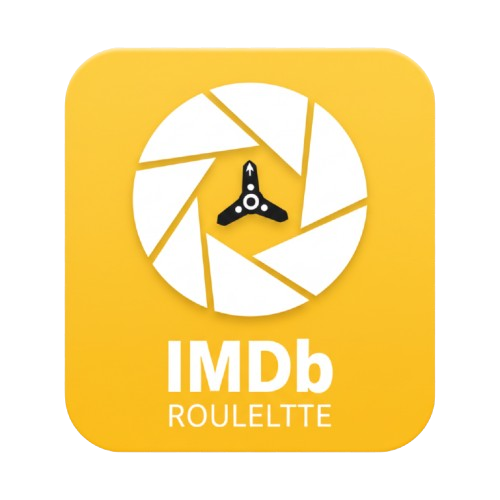

#  IMDb Watchlist Roulette

A simple, private, and powerful tool to help you decide what to watch next. Upload your exported IMDb watchlist CSV, apply filters, and let the roulette pick for you!

## 🚀 Live Demo
Visit the tool here: [https://watchlistroulette.me](https://watchlistroulette.me)

## 🛠️ How to Use
1. **Export your Watchlist**: Go to your IMDb Watchlist, scroll to the bottom, and click **"Export"** to download your `WATCHLIST.csv`.
2. **Upload**: Drag and drop that file into the roulette tool.
3. **Filter**: Use the advanced filters to narrow down by **Title Type** (Movie, TV Series, etc.), **Genre**, **Min Rating**, **Release Year**, or **Max Runtime**.
4. **Spin**: Click **"RANDOM PICK"** and get your result!

## 🔒 Privacy First
This tool runs entirely in your browser. Your watchlist data is never uploaded to any server; it is read locally from your computer.

## 💻 Built With
- HTML5 & CSS3
- Pure JavaScript (Vanilla JS)
